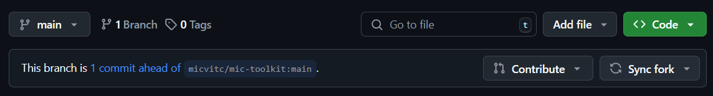
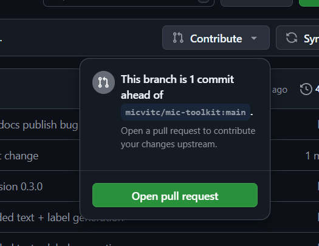
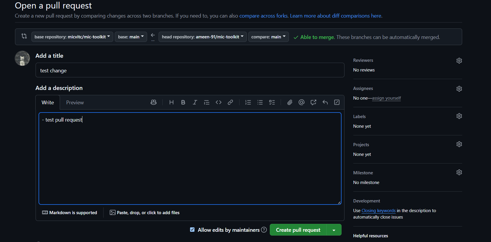
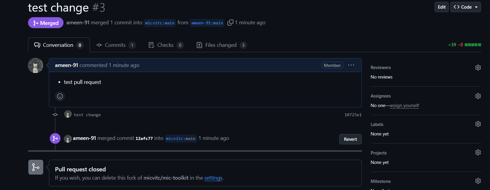

# Contribution Guidelines

## Steps

### 1. Fork the repository


### 2. Clone the repository

```bash
git clone https://github.com/your-github-id/mic-toolkit.git
```

### 3. Install dependencies

```bash
poetry install
```

Activate the environment

```bash
poetry shell
```

Make your changes, then commit and push them.

### 4. Create a pull request 









Once reviewed, the pull request will be merged.