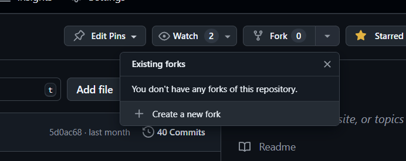

# Contribution Guidelines

## Steps

### 1. Fork the repository



### 2. Clone the repository

```bash

https://github.com/your-github-id/mic-toolkit.git

```

### 3. Install dependencies

```bash

poetry install

```
Activate envrionment

```bash

poetry shell

```

### 4. Commit and push some changes changes

```bash


```